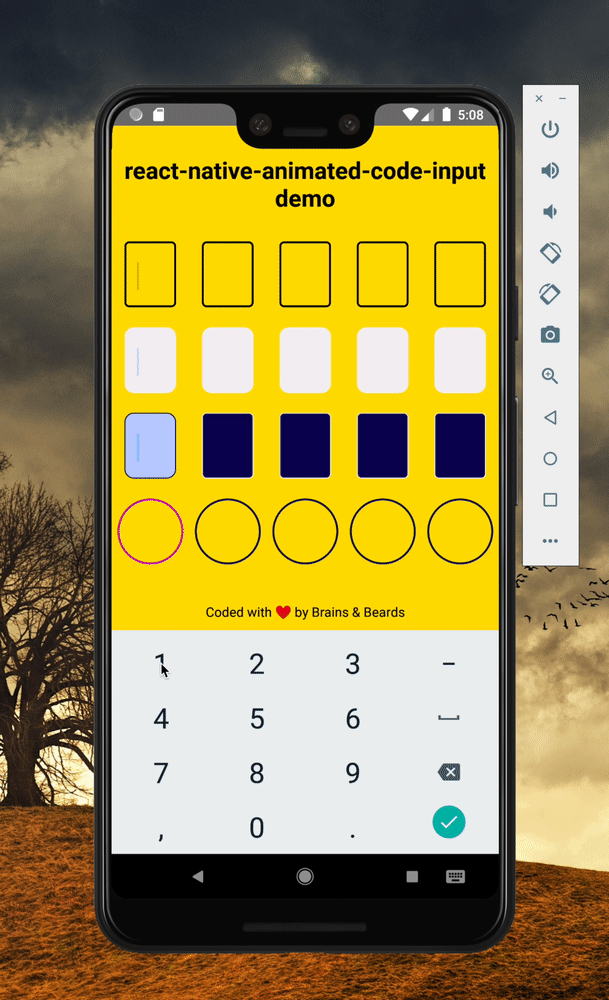
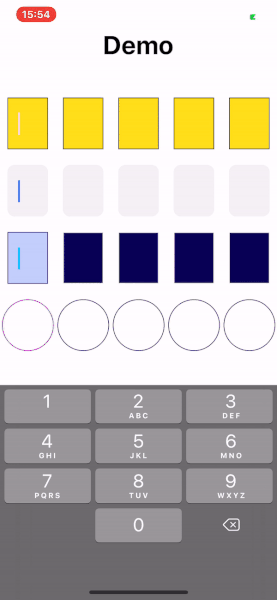

# Animated Code Input

## Description

Animated code input component for React Native, with support for iOS, Android, and React Native Web. It works with one-time password autofill on iOS and Android.

This component is fully customizable. You can change the appearance of the fields, cursor and animation timing. It presents code in separate input fields without losing support for filling out one time passwords from messages.

Two-factor authentication, for a good reason, is part of more and more applications. Many times the screen where the user has to enter the code is one of the first screens they will see in your app. As you know, users are fast to judge your app quality by the UI. Why not give them a sweet looking eye candy, where your app can stand out from the others? That's why we are sharing with you our Animated Code Input Field.

**Support: RN >=0.59.0**

## Demo

A small demo showing the animations and an automatic fill in of one-time passwords. On Android the user must tap the Copy button in the notification popup.

|                                                             Android                                                             |                                                         iOS                                                         |
| :-----------------------------------------------------------------------------------------------------------------------------: | :-----------------------------------------------------------------------------------------------------------------: |
|                            |                        |
|  |  |

## Getting started

### Installation

Install the package with npm.

```bash
npm install react-native-animated-code-input
```

or with yarn

```bash
yarn add react-native-animated-code-input
```

### Run example

```bash
 cd example
 yarn install
 cd ios
 pod install
 cd ..
 yarn react-native run-ios
```

## Simple Example

```js
import React, { FC, useRef, useState, useCallback } from "react";
import { TextInput, View, StyleSheet } from "react-native";
import AnimatedCodeInput from "react-native-animated-code-input";

const App: FC = () => {
  const [code, setCode] = useState<string>("");

  const onChangeText = useCallback((text: string) => {
    setCode(text);
  }, []);

  const onSubmit = useCallback((codeValue: string) => {
    Alert.alert(
      "DONE",
      codeValue,
      [{ text: "OK", onPress: () => setCode("") }],
      { cancelable: false }
    );
  }, []);

  return (
    <>
      <View style={styles.container}>
        <AnimatedCodeInput
          code={code}
          numberOfInputs={5}
          onChangeText={onChangeText}
          onSubmitCode={onSubmit}
        />
      </View>
    </>
  );
};

const styles = StyleSheet.create({
  container: {
    flex: 1,
    justifyContent: "center",
  },
});
```

## Attributes

Properties for this component:

| Prop                           | Type         | Default       | Description                                                                                                                                                                                               |
| ------------------------------ | ------------ | ------------- | --------------------------------------------------------------------------------------------------------------------------------------------------------------------------------------------------------- |
| `onSubmitCode` (**Required**)  | function     |               | Callback function called when every input field has a value. You will receive code value passed in as parameter                                                                                           |
| `value` (**Required**)         | string       | ''            | It is the value displayed by the input. Use the app state to update it on every key press. This is similar to how React Native TextInput works. Please refer to example if you need more guidance. value. |
| `onChangeText`  (**Required**) | function     | void          | Callback that is called when the text input's text changes.                                                                                                                                               |
| `numberOfInputs`               | number       | 1             | Number of code inputs                                                                                                                                                                                     |
| `onBlur`                       | function     | void          | Callback that is called when the text input loses focus.                                                                                                                                                  |
| `afterInputDelay`              | number       | 50            | Delay after which an input will be registered and fade in animation will start.                                                                                                                           |
| `cursorAnimationDuration`      | number       | 500           | Cursor animation duration                                                                                                                                                                                 |
| `codeAnimationDuration`        | number       | 300           | Code fade in animation duration                                                                                                                                                                           |
| `index`                        | number       | 0             | Active code input field                                                                                                                                                                                   |
| `codeContainerStyle`           | style object | {}            | Custom input style                                                                                                                                                                                        |
| `activeCodeContainerStyle`     | style object | {}            | Custom active input style                                                                                                                                                                                 |
| `cursorStyle`                  | style object | {}            | Custom cursor style                                                                                                                                                                                       |
| `textColor`                    | string       | black         | Input text color                                                                                                                                                                                          |
| `autoFocus`                    | boolean      | true          | Set to false if you want the user to press on the code input first before it starts register.                                                                                                             |
| `textContentType`              | string       | 'oneTimeCode' | Give the keyboard and the system information about the expected semantic meaning for the entered content. Leave it set to `oneTimeCode` if you want iOS to auto fill it from SMS.                         |

## Made with 💛 at Brains and Beards

Show some 💛 and star the repo to support the project

[](https://github.com/brains-and-beards/animated-pin-input) [](https://github.com/brains-and-beards/animated-pin-input/fork) [](https://github.com/brains-and-beards/animated-pin-input) [](https://github.com/brains-and-beards/animated-pin-input)  
[](https://twitter.com/brainsandbeards)

## Author & support

[](https://brainsandbeards.com)

[Brains and Beards](https://brainsandbeards.com/)

## Credits

Backdrop for the screenshot is an [amazing photo](https://unsplash.com/photos/MS2dni_S3Ew) by Johannes Plenio.
